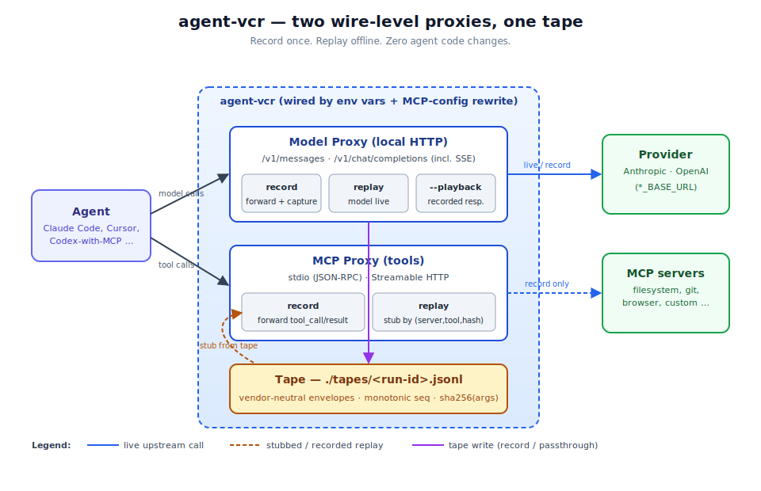
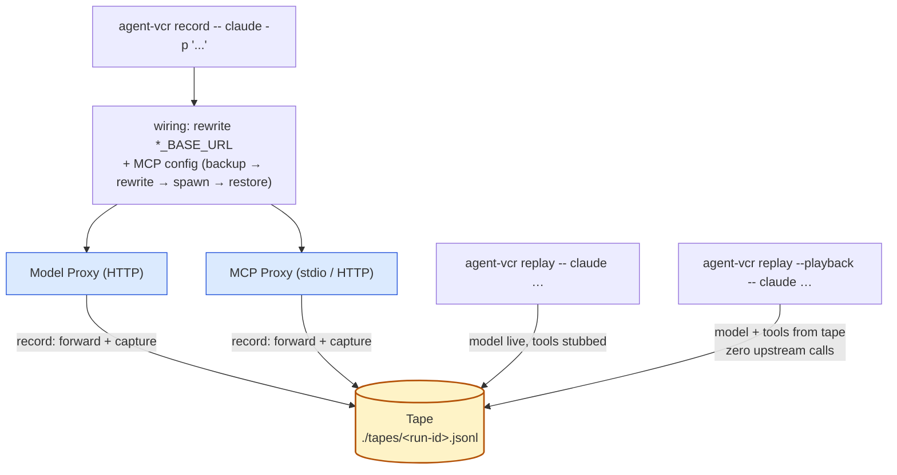
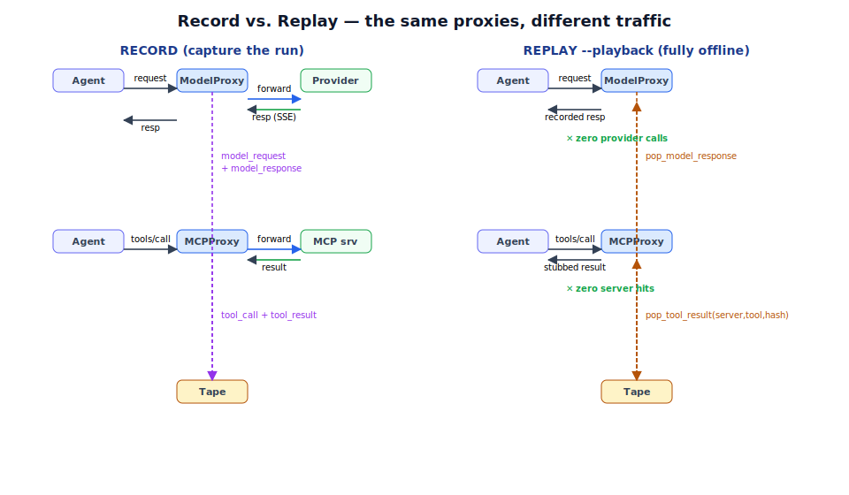
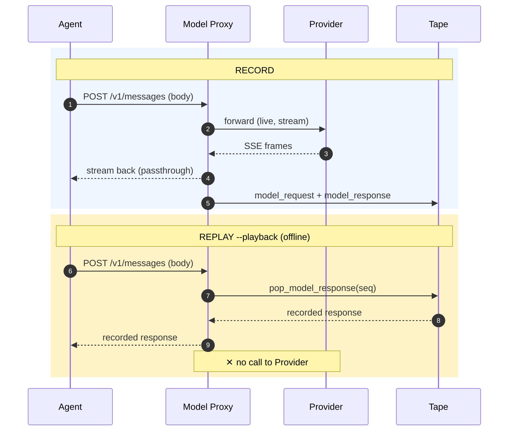
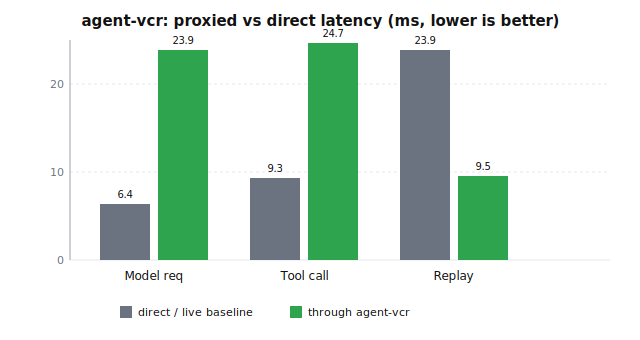

<div align="center">

# agent-vcr

**Local, vendor-neutral record / replay for AI agent runs.**

Two wire-level proxies sit between your agent and the outside world — one for the
model API, one for MCP tool servers — capture a run to a JSONL tape, and replay it
with tool outputs stubbed so you can reproduce bugs **offline, zero-cost, with no
side effects and no tool re-execution.** Zero agent code changes.

[](https://www.python.org)
[](./LICENSE)
[](#install)
[](#self-check)

</div>

---

<p align="center">
  
</p>

## Table of contents

- [The problem it solves](#the-problem-it-solves)
- [The methodology](#the-methodology)
- [How it works (mechanism)](#how-it-works-mechanism)
- [The tape format](#the-tape-format)
- [Install](#install)
- [Usage](#usage)
- [Tool-miss behavior on replay](#tool-miss-behavior-on-replay)
- [Supported agents](#supported-agents)
- [Project layout](#project-layout)
- [Security](#security)
- [Scope (v1)](#scope-v1)
- [Benchmarks](#benchmarks)
- [Self-check](#self-check)
- [License](#license)

---

## The problem it solves

Agent bugs are hard to reproduce because a run touches **a live model and live
tools**. Re-running means re-paying for tokens, re-mutating state, and hoping the
model makes the same choices. By the time something breaks you've already spent
the money and changed the world — so the failure is a moving target.

agent-vcr turns one run into a **repeatable, offline fixture**:

| Without agent-vcr | With agent-vcr |
|---|---|
| Reproduce = re-pay for tokens | Reproduce = read a JSONL file |
| Reproduce = re-mutate filesystem / DB / network | Reproduce = stubbed tool outputs, nothing touches the world |
| Flaky model choices → nondeterministic bug | `--playback` → bit-for-bit deterministic, no model call at all |
| "Works on my machine, fails in CI" | Same tape replays identically anywhere, offline |
| Bug discovered *after* the run that caused it | The run that caused it *is* the tape |

The key idea: you don't change the agent. agent-vcr rewires the **wire** — the
HTTP and stdio traffic the agent already emits — so the agent runs unaware while
every request and response is captured, then later faked.

## The methodology

Three deliberate design choices make this work for *any* MCP-using agent without
a per-agent integration:

1. **Wire-level, not API-level.** The proxies forward bytes they don't understand
   and only introspect the minimum needed to record/replay. No SDK to consume, no
   content normalization — provider quirks, SSE frames, and unknown fields pass
   through untouched. This is why a single tool supports Anthropic *and* OpenAI,
   *and* whatever OpenAI-compatible rides the `openai` path.

2. **Match tools by content hash, not by order.** A tool call is replayed by
   `sha256(canonical_json(args))` keyed on `(server, tool, args_hash)`. The agent
   doesn't have to call tools in the same order as the recorded run — only with
   the same arguments to the same tool. Divergence (a *different* call) is a
   signal, not silently papered over.

3. **Two replay knobs, not one.** Default replay keeps the model **live** and stubs
   only tools — so you can debug agent/tool interaction while still spending
   tokens. `--playback` also stubs the model, giving a fully offline, zero-cost,
   deterministic run for regression tests in CI.



## How it works (mechanism)

<p align="center">
  
</p>



- **Model proxy** — local HTTP server. Routes: `/v1/messages` (Anthropic) and
  `/v1/chat/completions` (OpenAI), including SSE streaming. In *record* it forwards
  to the real provider (via `ANTHROPIC_BASE_URL` / `OPENAI_BASE_URL`), reassembles
  the streamed response, and writes `model_request` + `model_response` events. In
  *replay* (default) the model stays live. In `--playback` it returns the recorded
  response and **never opens a connection to the provider**.

- **MCP proxy** — *stdio* (spawns the real MCP server as a subprocess and proxies
  JSON-RPC over its stdio) and *Streamable HTTP*. For each `tools/call` it records
  `tool_call` + `tool_result` keyed by `sha256(canonical_json(args))`. On replay it
  forwards non-`tools/call` traffic (handshake, `tools/list`) to a lazily-spawned
  real server and stubs only `tools/call` from the tape — matching by
  `(server, tool, args_hash)`.

- **Tape** — one JSONL file per run, vendor-neutral envelope, monotonic per-run
  `seq`. The model proxy (in-process, threaded) and each mcp-stdio proxy (a separate
  subprocess) all append to the *same* tape; writes are serialized with a
  threading lock plus a portable file lock (`msvcrt` on Windows, `fcntl` on POSIX)
  and `seq` is reconciled against the file on every write, so cross-process writers
  share one monotonic counter.

## The tape format

One event per line, vendor-neutral:

```jsonl
{"kind":"model_request","seq":1,"provider":"anthropic","body":{...}}
{"kind":"model_response","seq":1,"provider":"anthropic","body":{...},"usage":{...}}
{"kind":"tool_call","seq":2,"server":"fs","tool":"read_file","args":{...},"args_hash":"sha256:..."}
{"kind":"tool_result","seq":2,"result":{...}}
{"kind":"run_aborted","reason":"provider unreachable"}
```

- `seq` — monotonic per-run counter linking request↔response and tool_call↔result.
- `args_hash` — `sha256(canonical_json(args))`; canonical JSON = sorted keys, no
  whitespace. The replay match key for tools.
- `provider` — `anthropic` | `openai` (other OpenAI-compatible providers ride the
  `openai` path and are tagged by base URL in a `provider_url` field).
- `replay_extended` — set on events appended during `--on-miss passthrough` replay,
  so a grown tape is distinguishable from a pure recording.

## Install

```bash
pipx install .
# or, straight from the canonical repo:
pipx install git+https://github.com/Victorchatter/AgentVCR.git
```

Python 3.11+. **Zero runtime dependencies** — standard library only. Nothing to
download at runtime, no hosted backend, no telemetry.

## Usage

Record a Claude Code run:

```bash
agent-vcr record -- claude -p "refactor utils.py"
# → tape written to ./tapes/<run-id>.jsonl
```

Replay it with tools stubbed (model still live):

```bash
agent-vcr replay -- claude -p "refactor utils.py"
```

Fully deterministic, fully offline replay (no provider calls at all):

```bash
agent-vcr replay --playback -- claude -p "refactor utils.py"
```

Read tapes:

```bash
agent-vcr list
agent-vcr show ./tapes/<run-id>.jsonl
agent-vcr diff ./tapes/a.jsonl ./tapes/b.jsonl   # first diverging event
```

> **Note** the `--`. Everything after it is the agent command, forwarded verbatim.
  agent-vcr strips a single leading `--` so the agent sees the command exactly as
  you typed it.

## Tool-miss behavior on replay

If the agent calls a tool with arguments not present in the tape:

| `--on-miss` | Behavior | Use when |
|---|---|---|
| `strict` *(default)* | exit nonzero, print the unmatched call | you want divergence to be loud — the agent left the recorded run |
| `passthrough` | call the real server, append the new result, continue | you're iterating and want the tape to grow with the live run |

`passthrough` events are written via `append_replay_event` and marked
`replay_extended`, so a grown tape stays distinguishable from a pure recording.

## Supported agents

**Claude Code first.** Agent support is **config-driven, not code-driven**: any
agent that honors `*_BASE_URL` and reads an MCP config (`mcpServers` with stdio
`{command, args}` or HTTP `{url}` entries) works. agent-vcr rewrites the config in
place — backup at `<path>.vcr.bak`, restored on exit — and points `*_BASE_URL` at
the model proxy. Cursor, Codex-with-MCP, and custom agents following the same
conventions work the same way.

## Project layout

```
agent-vcr/
├── agent_vcr/
│   ├── tape.py        # JSONL tape: envelopes, seq, args_hash, cross-process lock
│   ├── model_proxy.py # /v1/messages + /v1/chat/completions (SSE), record/replay/playback
│   ├── mcp_proxy.py   # stdio + Streamable HTTP MCP, tools/call stub by hash
│   ├── wiring.py      # MCP-config rewrite + agent spawn (backup → rewrite → restore)
│   └── cli.py         # record / replay / mcp-stdio / list / show / diff
├── assets/            # architecture.svg, record-replay.svg, benchmark.svg
├── benchmarks/        # overhead.py — stdlib micro-bench (record overhead, replay, tape size)
├── docs/              # long-form notes
├── selfcheck.py       # one integration self-check, no test framework
├── pyproject.toml     # zero deps, pipx-installable, agent-vcr entrypoint
├── LICENSE            # MIT
└── README.md
```

## Security

- API keys are **forwarded** to the upstream provider but **never recorded** into
  the tape: `model_request` stores the parsed request *body* only, never headers.
- The tape is a plain JSONL file on your local disk. There is no hosted backend,
  no upload, no telemetry. What your run produced lives where you ran it.
- Replay stubs tool outputs from the tape, so a recorded run can reproduce tool
  side effects *without re-executing* them — replay a destructive run safely.

## Scope (v1)

**In:** `record`, `replay` (tool-stub + `--playback`), `list`, `show`, `diff`;
stdio + Streamable HTTP MCP; Anthropic Messages + OpenAI Chat Completions (SSE);
Claude Code config.

**Out:** non-MCP in-process tools, multi-agent orchestration, web UI, remote/shared
tape store, cross-provider content normalization, tape compression/rotation (tapes
are plain JSONL — bring your own `gzip`).

Deliberate simplifications are marked in the source with `# ponytail:` comments
naming the ceiling and the upgrade path — the code reads as intent, not ignorance.

## Benchmarks

`benchmarks/overhead.py` is a stdlib-only micro-bench that drives the real
`tape` / `model_proxy` / `mcp_proxy` modules against an in-process fake provider
and fake MCP HTTP server — no network, no external deps. Run it with:

```bash
python benchmarks/overhead.py
```

Representative numbers (Python 3.14, Windows loopback, keep-alive clients,
N=200 per row):

| Metric | Direct / live | Through agent-vcr | Delta |
|---|---|---|---|
| Model request latency (ms/req) | 6.4 | 23.9 | +17.5 ms |
| Tool call latency (ms/call) | 9.3 | 24.7 | +15.5 ms |
| Replay model latency (ms/req) | — | 9.5 | 2.5× faster than live-through-proxy, 0 upstream calls |
| Tape size per run (200 reqs + 200 calls) | — | ~175 KB | ~217 B/event |

<p align="center">
  
</p>

The delta is **one extra localhost connection setup per request** — the proxy
opens a fresh upstream connection each call (no pooling). Against a real remote
upstream that one extra setup is negligible relative to the upstream's network
latency; the proxy's own per-request work (byte-forward + one tape append) is
sub-millisecond. Replay is faster than a live **proxied** run and makes **zero**
upstream calls — no cost, no side-effects, deterministic — which is the point of
replay, not raw speed against a fast fake. Full methodology and numbers
reproduce from `python benchmarks/overhead.py`.

## Self-check

```bash
python selfcheck.py
```

One runnable self-check, **no test framework**. It spins up a fake provider
(canned `tool_use`, then canned final text, with a call counter) and a fake MCP
stdio server (echoes args), then drives a scripted agent through
**record → replay (tool-stub) → `--playback` (zero provider calls) → strict-miss**,
plus SSE-streaming and MCP-handshake cases. It exits nonzero on failure. Per the
project's hard constraint, this is the only test shipped — everything else is
exercised by it.

## License

MIT — see [LICENSE](./LICENSE).

<div align="center">

<sub>Built to make flaky agent runs repeatable. Record once, replay anywhere.</sub>

</div>